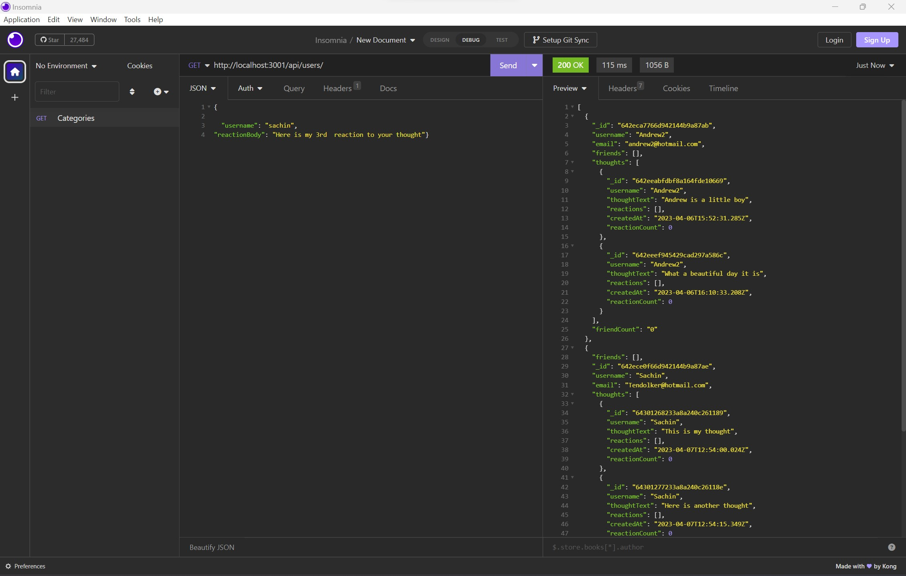
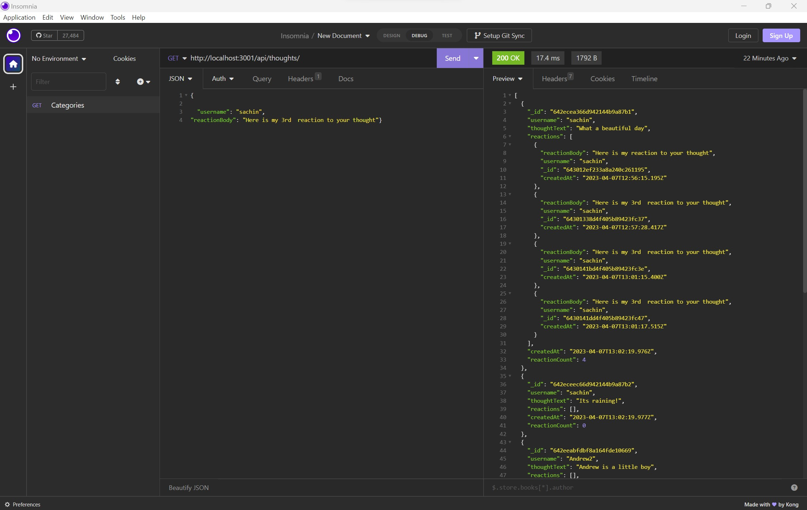

# Social Network API

## Description

This application code demonstrates the back end interface between NODE JS and MongoDB database through the use of Object Document Mapping(ODM). This application uses Mongoose library to create models and Express to respond to API requests.

## How to run the application

#### Prerequisites:
- Node JS
- MongoDb server
- API Client software (Insomnia or Postman)
- MongoDb Compass

#### Steps:

1) Clone this repository to your machine by typing `git@github.com:zafarfast/sm492013843234.git` on the terminal.
2) Install all dependencies by typing `npm install`.
3) Start MongoDb server using MongoDb Compass. More information on this here https://www.mongodb.com/docs/compass/current/connect/
4) Run the application by typing `node index.js` in the terminal.

## Links

Github: https://github.com/zafarfast/sm492013843234

Screenshare: https://watch.screencastify.com/v/DjGS2H4JwgmUUpHBBVR3

## Screenshots

